# Practice Overview

> Anna Hellmuth - online psychological counseling and life coaching. This document holds the mental model. Every other doc drills down. When in doubt, come back here.

## Thesis

People do not buy counseling or coaching. They buy **movement** - relief, clarity, confidence, transformation. Anna's practice exists to help sensitive, thoughtful, high-functioning people create the lasting inner change that insight alone could never give them.

The unfair advantage is a combination almost no one else holds at once: **psychological depth** (medical doctor, psychologist, hypnotherapist) + **coaching practicality** + **pattern recognition** + **genuine warmth** + **lived experience**. Anna does not speak from above. She has been there - surgery, burnout, the pivot into psychology - and she names the client's experience so precisely they think *"finally, someone understands."*

## North star

A highly profitable online practice that funds a calm, free, meaningful life - not a high-volume grind.

- **€300,000** annual income
- **≤6-7** working hours per day
- **2** completely free days per week
- **High-quality clients** over volume
- A feminine, enjoyable lifestyle with room for reading, culture, relationships, and growth

Every decision in this suite is tested against this: does it move toward depth, trust, and freedom - or toward volume and burnout?

## Who we serve

Sensitive, deep-feeling adults who understand a lot about themselves and still feel stuck. Two overlapping lanes:

- **Counseling** (past/emotional): women 25-45 and gay men; high-functioning, often with cold or absent early parenting; depression, anxiety, shame, attachment fear, body image, expat displacement. Ukrainian women abroad are one meaningful segment.
- **Coaching** (future/goals): men and women 30-45; goal-oriented doers, often the oldest child, high-functioning but craving depth; paralysis, fear of failure/success, identity change, transitions.

Full profiles: [01-strategy/03-ideal-client-profile.md](01-strategy/03-ideal-client-profile.md).

## What we sell

| Stage | Offer | Price |
|-------|-------|-------|
| Entry (free) | 30-min discovery call | Free |
| **Wedge (proposed, TBD)** | **Clarity Session** - 90 min + written pattern summary | €250-€300 |
| Single | Counseling session | €120 |
| Package | Counseling 6-pack | €660 |
| Program | The Next Chapter - 16-week 1:1 coaching program | €1,950 |

Details: [03-offerings/](03-offerings/). Prices are canonical in the `practice-profile` skill.

## Operating principles (guardrails)

1. **Sell movement, not process.** Lead with the change the reader wants. Methods and credentials live on trust pages, never in social hooks.
2. **Make them feel understood.** One post that makes the right person think *"that's exactly me"* beats twenty generic ones.
3. **Respect adults.** No pressure, no urgency, no guilt. Help people understand their situation and invite the next step. They decide.
4. **Depth over volume.** Consistency and depth, aligned with the work-life-balance goal. No hustle framing, ever.
5. **Facts are sacred.** Prices, credentials, claims come only from `practice-profile`. Unknowns are TBD. Never invent metrics, client names, or guarantees.
6. **Confidentiality first.** Client stories are patterns, never people. Testimonials are anonymous and opt-in.

## Section map

```mermaid
flowchart LR
    overview[00 Overview] --> strategy[01 Strategy]
    strategy --> brand[02 Brand]
    brand --> offerings[03 Offerings]
    offerings --> marketing[04 Marketing]
    marketing --> sales[05 Sales]
    sales --> operations[06 Operations]
    operations --> finance[07 Finance and Legal]
    finance --> roadmap[08 Roadmap]
    roadmap --> toolkit[09 Toolkit]
```

| # | Domain | Read it for |
|---|--------|-------------|
| 01 | [Strategy](01-strategy/) | Vision, positioning, ICP, market, model, pricing, plan |
| 02 | [Brand](02-brand/) | Brand strategy, voice, messaging, design (mostly pointers to `brand/`) |
| 03 | [Offerings](03-offerings/) | Catalog, the Clarity Session wedge, packages, products |
| 04 | [Marketing](04-marketing/) | Content engine, channels, lead gen, funnel, compliance |
| 05 | [Sales](05-sales/) | Process, discovery-to-wedge, agreement, onboarding |
| 06 | [Operations](06-operations/) | Tools, workflow, SOPs, quality bar |
| 07 | [Finance & Legal](07-finance-legal/) | DACH legal, finance model, runway, projections |
| 08 | [Roadmap](08-roadmap/) | 90-day plan, transition, KPIs, backlog |
| 09 | [Toolkit](09-toolkit/) | Discovery script, posts, calendar, emails, templates |

## So what

If you read only three things, read this overview, [positioning & niche](01-strategy/02-positioning-and-niche.md), and the [Clarity Session wedge](03-offerings/02-wedge-offer-clarity-session.md). They tell you what Anna sells, to whom, and why it is credible. Everything else is execution.
