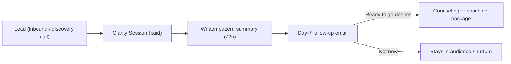

# Wedge Offer — The Clarity Session

> **Status: PROPOSED / TBD.** Name, price, and exact promise are not final and must be confirmed by Anna before publishing. This is the productized entry offer the suite is designed around. Operational methodology lives in the `wedge-clarity-session` skill.

## Why this offer exists

There is a large gap between a **free** discovery call and a **€660–€1,920** package. Many ideal clients are insight-rich but cautious; they want to *feel* the depth before committing. The Clarity Session is the missing rung: a premium, low-commitment way to experience Anna's core strength — naming the pattern precisely, with warmth and grounded certainty — and leave with something concrete.

It does **not** replace the free discovery call (which stays a fit check). It sits one rung above it.

## The offer

| Attribute | Spec (proposed) |
|-----------|-----------------|
| Name | Clarity Session (working title) |
| Format | Single 90-minute online session |
| Deliverable | 1–2 page written **pattern summary**, delivered within 72 hours |
| Price | €250–€300 (TBD) |
| Lane | Works for both counseling and coaching prospects |
| Promise | *Leave with a clear map of the pattern keeping you stuck — and the next step forward — without committing to a full package.* |

## Conversion mechanics

The summary itself is the conversion asset: it demonstrates value, names the next step, and makes continuing feel like the natural choice — never a hard sell.

## Delivery SOP (run every time)

1. **Pre-session intake** — send the intake form (current situation, what feels stuck, what they've tried, what they want).
2. **90-minute session** — recognition → name the pattern → what keeps it locked → where it shows up → possible next step.
3. **Draft the written summary** within 48 hours.
4. **Review and send** within 72 hours of the session.
5. **Day-7 follow-up email** inviting a package conversation (no pressure).

## Written summary structure (deliverable)

Template: [../09-toolkit/06-wedge-deliverable-template.md](../09-toolkit/06-wedge-deliverable-template.md).

1. **The pattern we named** — the core inner loop, in plain language
2. **What keeps it locked** — the protective logic underneath
3. **Where it shows up** — concrete life areas (work, relationships, body, decisions)
4. **The next step** — recommended path: counseling package / coaching package / specific focus / referral

## Starter checklist

- [ ] Intake form sent and returned
- [ ] Calendar slot booked, Zoom link sent
- [ ] Session held; notes captured
- [ ] Summary drafted in Anna's voice (`practice-voice`)
- [ ] Summary reviewed and sent within 72h
- [ ] Day-7 follow-up scheduled

## Productization assets to build

- [ ] Intake form (reusable)
- [ ] Written summary template ([../09-toolkit/06-wedge-deliverable-template.md](../09-toolkit/06-wedge-deliverable-template.md))
- [ ] Wedge landing/render page ([../../render/03-offerings-02-wedge-clarity-session.html](../../render/03-offerings-02-wedge-clarity-session.html))
- [ ] Day-7 follow-up email ([../09-toolkit/05-client-emails.md](../09-toolkit/05-client-emails.md))
- [ ] Booking + payment flow (€ price, payment on booking)

## Open decisions for Anna (TBD)

- [ ] Confirm name ("Clarity Session" vs alternatives)
- [ ] Confirm price within €250–€300
- [ ] Confirm whether price partially credits toward a package
- [ ] Confirm compliance framing (Beratung, not Psychotherapie — see [../07-finance-legal/01-legal-setup-germany.md](../07-finance-legal/01-legal-setup-germany.md))

## So what

This is the single most important Anna-specific addition to the funnel: a productized bridge that should lift conversion from interest to committed packages without pressure or volume. Nothing publishes until the TBDs above are confirmed.
