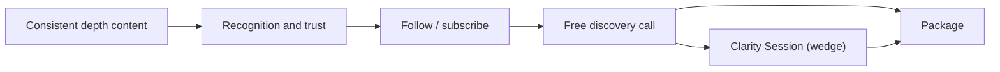

# Marketing Strategy

## The one claim

Marketing's only job is to make the right person feel *"finally, someone understands what I've been experiencing - and she clearly knows how to help."* That feeling is the entire engine. Everything else is logistics.

## Strategy: positioning-led, reputation funnel

Anna does not buy attention; she earns trust. The model is **inbound, depth-led, compounding** - consistent content that demonstrates how she thinks, builds recognition, and lowers acquisition cost over time. This fits the premium, low-volume, work-life-balance north star (paid acquisition and volume tactics would break it).

## Principles (from positioning + sales)

1. **Sell movement, not process.** Lead with the change; methods/credentials on trust pages only.
2. **Depth over volume.** One powerful post beats twenty generic ones.
3. **Consistency over bursts.** Small actions repeated win.
4. **Trust → visibility → consistency → depth** are the four attraction levers.
5. **No hustle, no pressure, no hype.** Aligned with the calm brand.

## Channel priorities

| Priority | Channel | Role |
|----------|---------|------|
| 1 | Instagram (@anna_hellmuth.md) | Primary visual channel; intimacy + reach |
| 2 | LinkedIn (Anna Hellmuth) | Authority, professional ICP |
| 3 | Blog / SEO | Compounding, search-driven trust |
| 4 | Newsletter (TBD) | Owned audience, nurture |
| 5 | TikTok / Facebook | Experimental / legacy reach |

Detail: [03-channels.md](03-channels.md).

## Cadence (minimum)

1 counseling post + 1 coaching post per week, every week. Consistency matters more than volume (see [02-content-engine.md](02-content-engine.md)).

## What success looks like

- The right people regularly comment/DM "this is exactly me"
- Steady discovery-call bookings without paid ads
- Reputation compounding so each month is easier than the last

## So what

Marketing is a patient trust machine, not a lead-blitz. The plan: show up consistently with depth, let reputation compound, and convert with the discovery call → wedge → package funnel. Detail in the rest of this section; execution in [../09-toolkit/](../09-toolkit/).
