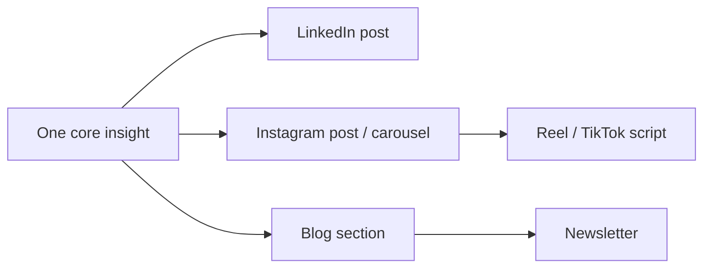

# Content Engine

> How content gets made consistently without burning out. Voice rules: `practice-voice` + `content-writing` skills and [brand/marketing/content.md](../../../brand/marketing/content.md).

## Content philosophy

The goal is not to sound smart. The goal is to make the right person feel *"she understands exactly what I experience."* When people feel understood, trust develops naturally.

## Pillars

| Pillar | Lane | Sample themes |
|--------|------|---------------|
| Emotional patterns | Counseling | shame, attachment, regulation, body image, depression, expat loneliness |
| Inner blocks to action | Coaching | fear, paralysis, identity change, transitions, authentic success |
| The core thesis | Both | "insight isn't enough", understanding vs release |
| Lived perspective | Both | Anna's own pivots and learnings (no oversharing) |
| Gentle myth-busting | Both | reframing "lazy", "should be over it", "just think positive" |

## The strong-post formula

1. A recognizable experience
2. A surprising insight
3. An emotional truth
4. A practical implication

> You think X. Actually, Y is happening. That is why Z feels so difficult.

## Formats

| Format | Notes |
|--------|-------|
| IG / LI single post | One insight; recognition-led; soft optional CTA |
| Carousel | One insight per slide; slide 1 = recognition; last = soft CTA optional |
| Reel / TikTok | Hook + body + soft close, 30–60s |
| Blog | Flowing paragraphs; movement-first opening; credentials in bio |
| Newsletter | One theme; personal lens; CTA only if natural |

## Cadence

**Minimum: 1 counseling + 1 coaching post per week.** Consistency over volume. Batch-write to protect free days.

## Repurposing pipeline

One insight → many formats. A blog post seeds a carousel, a reel, a LinkedIn post, and a newsletter section. This is how a low-volume practice produces consistent content without grinding.

## The checklist (before posting)

Relevance · Specificity · Authenticity · Emotional connection · Depth · Business value. (Full version in [brand/marketing/content.md](../../../brand/marketing/content.md).) Then run the humanizer pass.

## Sources (priority order)

1. Things Anna has genuinely struggled with
2. Things she has genuinely learned
3. Patterns observed repeatedly in clients (anonymized — see [../03-offerings/05-case-study-strategy.md](../03-offerings/05-case-study-strategy.md))
4. Ideas she genuinely believes

Not: generic educational content or modality explanations.

## So what

The engine is: pick a real insight, write it recognition-first in Anna's voice, repurpose across formats, post consistently (1+1/week). Channels in [03-channels.md](03-channels.md); ready content in [../09-toolkit/](../09-toolkit/).
