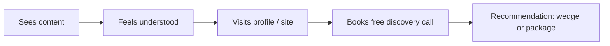

# Lead Generation

How interest becomes a booked discovery call - inbound-first, no pressure, fully compliant.

## Philosophy

Anna attracts; she does not chase. Leads come from people who already feel understood by the content and self-select toward a conversation. This protects the brand and complies with German outreach law (see [06-outreach-compliance-germany.md](06-outreach-compliance-germany.md)).

## Inbound mix (primary)

| Source | Mechanism | CTA |
|--------|-----------|-----|
| IG / LI content | Recognition-led posts → profile → bio link | Schedule discovery call |
| IG DMs | People respond to stories/posts → warm conversation | Invite discovery call |
| Blog / SEO | Search → article → in-article CTA | Discovery call / service page |
| Directory listing | Passive credibility → site | Discovery call |
| Referrals | Past clients, peers | Warm intro |
| Lead magnet (future) | Email capture → nurture | Discovery call |

## The conversion path

## CTAs (hierarchy)

| Priority | CTA | Where |
|----------|-----|-------|
| Primary | Schedule your discovery call | bio, hero, content footers |
| Secondary | Discover Counseling Services | counseling content |
| Secondary | Explore Coaching Details | coaching content |
| Tertiary | Learn more about me | trust content |

Discovery call URL: https://calendar.app.google/ueKb9RbyxWyC6zfK8

## Lead magnets (future, optional)

- Pattern self-assessment (PDF/quiz) mirroring the "insight isn't enough" wedge
- Short guide: "When understanding isn't enough"
- Both feed email capture (double opt-in) → newsletter → discovery call

## What NOT to do

- No cold email or cold DMs to people who haven't engaged (UWG §7)
- No "limited spots", urgency, or guilt
- No buying lists or paid lead-gen schemes that clash with the premium brand

## So what

Lead gen = consistent recognition-led content + a clear soft CTA + a frictionless discovery-call booking. Outbound is warm/referral only. Sequences and warm-outreach specifics: [07-outreach-plan.md](07-outreach-plan.md).
