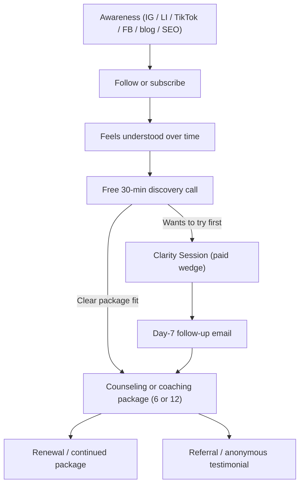

# Marketing Funnel

The full path from a stranger seeing a post to a committed package client. Rendered version: [../../render/04-marketing-08-funnel.html](../../render/04-marketing-08-funnel.html).

## The funnel

## Stage by stage

| Stage | Goal | Key asset | Metric |
|-------|------|-----------|--------|
| Awareness | Be seen by the right person | Recognition-led posts | Reach, profile visits |
| Follow / subscribe | Stay in their world | Consistency, bio CTA | Followers, subscribers |
| Resonate | Build trust over time | Depth content, blog | Saves, DMs, "that's me" |
| Discovery call | Understand + recommend | Discovery script | Calls booked, show rate |
| Wedge | Let them feel the depth | Clarity Session + summary | Wedge bookings, → package rate |
| Package | The transformation + revenue | Sessions, quality bar | Packages sold, completion |
| Renewal / referral | Compounding growth | Renewal + testimonial emails | Renewals, referrals |

## Conversion levers

- **Awareness → follow:** consistency + a strong profile/bio
- **Resonate → discovery:** the precise "that's me" feeling + a frictionless booking link
- **Discovery → wedge/package:** the no-pressure recommendation (see [../05-sales/02-discovery-to-wedge-script.md](../05-sales/02-discovery-to-wedge-script.md))
- **Wedge → package:** the written summary + day-7 follow-up
- **Package → renewal/referral:** outcomes + a warm, opt-in ask

## Leaks to watch

- Great content but weak/absent CTA → fix the bridge to the call
- Discovery calls that don't convert → tighten the recommendation, consider the wedge
- One-and-done clients → strengthen renewal invitations

## So what

The wedge is the funnel's new accelerant between free and high-commitment. Optimize the two highest-leverage transitions: resonate→discovery and discovery→wedge/package. KPIs: [../08-roadmap/03-milestones-and-kpis.md](../08-roadmap/03-milestones-and-kpis.md).
