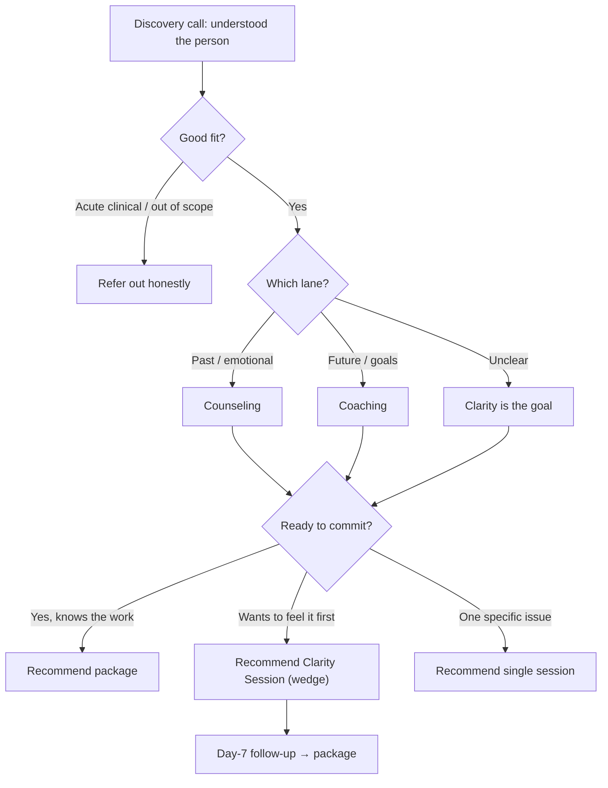

# Discovery → Recommendation Decision Tree

How to move from a discovery call to a clear, no-pressure recommendation. Pairs with the full script in [../09-toolkit/01-discovery-call-script.md](../09-toolkit/01-discovery-call-script.md) and the `discovery-calls` skill.

## The decision tree

## Lane decision cues

| They say… | Lane |
|-----------|------|
| "I can't move past / I keep carrying…" | Counseling |
| "I want to / I'm trying but can't act…" | Coaching |
| "I don't know where to start" | Start where pressure is loudest; clarity is valid |

## Commitment cues → offer

| Signal | Offer |
|--------|-------|
| Decisive, understands depth takes continuity | Package (6-pack / coaching 6 or 12) |
| Interested but hesitant to commit to many sessions | Clarity Session wedge (TBD) |
| Wants help with one concrete thing | Single session |
| Needs time | Send recommendation + link; no pressure |

## How to present the wedge (when confirmed)

> "If you'd like to experience how I work and leave with a clear map before committing to a longer package, there's a single Clarity Session — 90 minutes plus a written summary of the pattern we find. Some people start there; others go straight into a package. Both are completely fine."

## The close (no pressure)

- "Take whatever time you need."
- "If it feels right, here's how we'd start. If not, that's completely okay."
- Offer to send a short follow-up email with the recommendation and the link.

## So what

The recommendation is a clear fork: refer out, single, wedge, or package — chosen by lane + commitment, delivered without pressure. The wedge is the bridge for the hesitant-but-interested. Full wording: [../09-toolkit/01-discovery-call-script.md](../09-toolkit/01-discovery-call-script.md).
