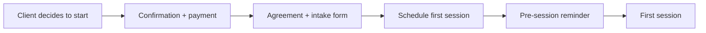

# Client Onboarding & Offboarding

A warm, frictionless start (and a clean ending) for every engagement. Email templates: [../09-toolkit/05-client-emails.md](../09-toolkit/05-client-emails.md).

## Onboarding flow

## Steps

1. **Confirmation & payment** - confirm the service, then send bank-transfer
   and Revolut payment details.
2. **Agreement** - send the counseling/coaching agreement ([03-counseling-agreement.md](03-counseling-agreement.md)).
3. **Intake form** - short form: current situation, what feels stuck, what they've tried, what they want, language preference.
4. **Scheduling** - book the first (and recurring) sessions via calendar; send the video link.
5. **Pre-session reminder** - 24h before; "nothing to prepare."
6. **First session** - recognition-led; set expectations; begin the work.

## Communication norms

- Channel: email for logistics; sessions on the agreed platform
- Response time: within 24-48h on business days
- Boundaries: sessions are the space for the work; between-session contact is limited (coaching assignments excepted)
- Emergencies: counseling is not crisis care - clients use emergency services if at risk

## Access & tools

Calendar invite, video link, any shared documents (e.g. coaching action plans). Keep client data within DPA-covered tools (see [../06-operations/01-tools-and-stack.md](../06-operations/01-tools-and-stack.md)).

## Offboarding

- **Package completion:** brief reflection on progress; invite renewal without pressure (renewal email).
- **Natural ending:** acknowledge the work; leave the door open.
- **Referral out:** if needs exceed scope, refer warmly and clearly.
- **Testimonial ask:** only after meaningful progress, anonymous, opt-in, easy to decline.
- **Data:** retain/delete per the privacy policy and GDPR.

## So what

Onboarding sets the tone (warm, clear, professional); offboarding protects the relationship and seeds renewals/referrals. Templates make both repeatable: [../09-toolkit/05-client-emails.md](../09-toolkit/05-client-emails.md).
