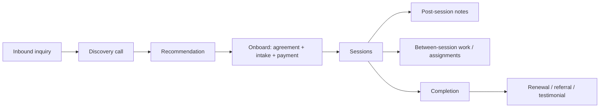

# Delivery Workflow

End-to-end flow for delivering counseling, coaching, and the wedge — designed to be repeatable and to protect Anna's time and energy.

## Full engagement flow

## Per-session loop

1. **Prep** — review prior notes + intake; set an intention for the session.
2. **Session (60 / 90 min)** — recognition → work → grounding; hold the quality bar ([04-quality-bar.md](04-quality-bar.md)).
3. **Post-session notes** — brief, secure, EU-hosted; capture themes and next focus (never in non-covered tools).
4. **Between-session** — coaching: action plan/assignments; counseling: as appropriate.
5. **Continuity** — confirm next session.

## Wedge (Clarity Session) flow

Follows the SOP in [../03-offerings/02-wedge-offer-clarity-session.md](../03-offerings/02-wedge-offer-clarity-session.md): intake → 90-min session → draft summary (48h) → send (72h) → day-7 follow-up.

## Energy & scheduling principles

- Anna prefers well-rested sessions; cluster sessions to protect the 2 free days.
- Cap sessions/day in line with the work-hour limit — depth requires presence.
- Build buffer for notes and summaries (especially wedge deliverables).

## Handoffs & continuity

- Recommendation → onboarding handoff via email templates ([../09-toolkit/05-client-emails.md](../09-toolkit/05-client-emails.md))
- Clear next-step at the end of every session
- Renewal/offboarding handled deliberately ([../05-sales/04-onboarding.md](../05-sales/04-onboarding.md))

## So what

A clean, repeatable loop (prep → session → notes → between → continuity) plus a defined wedge flow keeps delivery high-quality and sustainable. Standardized in SOPs: [03-sops.md](03-sops.md).
