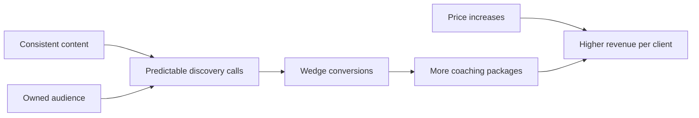

# Financial Projections

> **Illustrative scenarios**, not forecasts. They show shape and trajectory, not promises. All figures pre-tax; tax treatment per [01-legal-setup-germany.md](01-legal-setup-germany.md). Built on current prices.

## Assumptions

- Prices per [../01-strategy/07-pricing-and-packaging.md](../01-strategy/07-pricing-and-packaging.md)
- Wedge (€250-€300) live from Year 1, TBD-confirmed
- Low overhead; lean tool stack
- Growth from price + mix + wedge conversion, not added hours
- Sustainable session cap maintained throughout

## Three scenarios (annual revenue)

| Scenario | Year 1 | Year 2 | Year 3 | Driver |
|----------|--------|--------|--------|--------|
| Conservative | building / stabilizing | steady inbound | modest growth | Consistency only; few price moves |
| Base | stabilizing | growing pipeline + wedge | approaching mid-range | Wedge converts; first price increase |
| Ambitious | stabilizing | strong pipeline | trending toward €300k goal | Premium pricing, coaching-12 mix, owned audience, leverage |

The €300k north star is a **5-year** target; Years 1-3 are about building the predictable, premium pipeline that makes it reachable without volume.

## What moves each scenario up

## Sensitivity (the few things that matter most)

1. **Discovery calls/month** - the master input (see KPIs)
2. **Discovery → package conversion** - recommendation quality + wedge
3. **Average price** - package mix + price increases over time
4. **Retention/renewal** - cheapest revenue there is

Small improvements in these compound; chasing volume does not.

## Review

Revisit projections quarterly against actuals; adjust prices and mix as reputation grows. Hold the hour/free-day limits as fixed constraints.

## So what

Years 1-3 build a premium, predictable pipeline; the €300k goal is a 5-year outcome of price + mix + conversion + retention - never more hours. Track the four sensitivities in [../08-roadmap/03-milestones-and-kpis.md](../08-roadmap/03-milestones-and-kpis.md).
