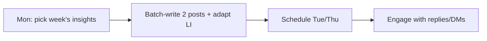

# 90-Day Content Calendar

A week-by-week plan that guarantees the minimum rhythm - **1 counseling + 1 coaching post per week** - while introducing the practice and the wedge. Maps directly to the toolkit batches.

> Default channel mix: Instagram (primary) + LinkedIn (authority), with periodic blog and Reels/TikTok. Adapt to capacity; consistency beats volume. Posts referenced by their toolkit IDs.

## Weekly skeleton

| Day | Slot | Source |
|-----|------|--------|
| Tue | Counseling post (IG + adapt LI) | counseling batch / launch set |
| Thu | Coaching post (IG + adapt LI) | coaching batch / launch set |
| (flex) | Story / behind-the-practice | improvised, warm |
| Every 2-3 wks | Blog post + repurpose | [13-blog-post-batch.md](13-blog-post-batch.md) |
| Monthly | Newsletter (once live) | [12-newsletter-templates.md](12-newsletter-templates.md) |

## Phase 1 - Weeks 1-4 (Foundation / launch)

Lead with the launch sets ([02](02-instagram-launch-posts.md) / [03](03-linkedin-launch-posts.md)).

| Week | Tue (counseling) | Thu (coaching) | Extra |
|------|------------------|----------------|-------|
| 1 | IG #1 Introduction | IG #4 Coaching lens | Story: why I do this work |
| 2 | IG #3 Counseling lens | IG #2 Core thesis | Blog #1 + repurpose |
| 3 | IG #5 Burnout | IG #6 Expat *(or coaching #?)* | Story: a day in the practice |
| 4 | IG #7 Myth-bust | IG #9 Counseling vs coaching | IG #10 Discovery call |

## Phase 2 - Weeks 5-8 (Visibility / convert)

Move into theme batches ([09](09-instagram-posts-counseling.md) / [10](10-instagram-posts-coaching.md)); start LinkedIn cadence.

| Week | Tue (counseling) | Thu (coaching) | Extra |
|------|------------------|----------------|-------|
| 5 | Counseling #1 (shame) | Coaching #1 (fear) | LI #2 thesis |
| 6 | Counseling #2 (attachment) | Coaching #2 (paralysis) | Blog #2 + repurpose |
| 7 | Counseling #3 (regulation) | Coaching #3 (identity) | Reel from a top post |
| 8 | Counseling #4 (body image) | Coaching #4 (transitions) | IG #11 Clarity Session *(if confirmed)* |

## Phase 3 - Weeks 9-12 (Momentum / deepen)

Add multilingual + proof; keep rhythm.

| Week | Tue (counseling) | Thu (coaching) | Extra |
|------|------------------|----------------|-------|
| 9 | Counseling #5 (depression) | Coaching #5 (authentic success) | Multilingual post (DE or UK/RU) |
| 10 | Counseling #6 (expat loneliness) | Coaching #6 (self-leadership) | Blog #3 + repurpose |
| 11 | Counseling #7 | Coaching #7 | Anonymous pattern story |
| 12 | Counseling #8 | Coaching #8 | IG #12 soft invitation; newsletter #1 |

## Phase 4 - Weeks 13+ (Sustain)

Continue the Tue/Thu rhythm from the theme batches; add TikTok scripts ([11-tiktok-script-batch.md](11-tiktok-script-batch.md)); recycle top performers; introduce more multilingual ([14-multilingual-adaptations.md](14-multilingual-adaptations.md)).

## Batching rhythm (protect free days)

Write a week (or two) at once; schedule; then only engagement remains during the week.

## Rules

- Never skip the 1+1 minimum.
- Run the humanizer pass on each before scheduling.
- Soft CTA only; rotate which posts carry one.
- Hold wedge posts until the offer is confirmed.

## So what

This calendar turns the strategy's "1 counseling + 1 coaching per week" into a concrete, source-linked schedule for 12+ weeks, front-loaded with the launch sets. Batch it to protect the two free days. Content to fill it: the toolkit batches.
